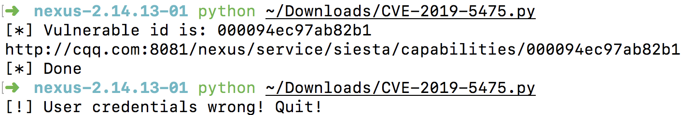
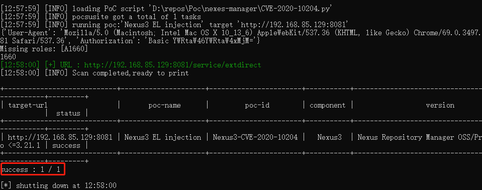
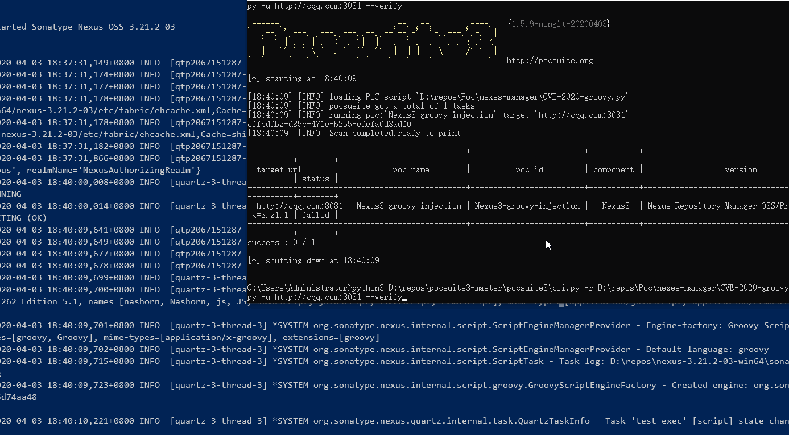

### CVE-2019-5475/CVE-2019-15588
< 3.15.0

### CVE-2019-16530 Nexus Repository Manager 2 & 3, and Nexus IQ Server
<= 2.14.14；<= 3.18.1（管理员权限）
> An attacker with elevated priveledges can upload a specially crafted file.  That file can contain commands that will be run on the underlying systems as the user who owns the server process.  

ref:
- https://support.sonatype.com/hc/en-us/articles/360036132453-CVE-2019-16530-Nexus-Repository-Manager-2-3-and-Nexus-IQ-Server-Remote-Code-Execution-2019-09-19

### CVE-2019-15893 Nexus Repository Manager 2 - Remote Code Execution
<= 2.14.15（管理员权限）
>  The vulnerability allows for an attacker with administrative access to NXRM to create repostories that can grant access to read/execute system data outside the scope of NXRM. 

ref:
- https://support.sonatype.com/hc/en-us/articles/360035055794

### CVE-2020-10204/CVE-2020-10199
<= 3.21.1（普通用户权限）

### CVE-2020-11753
<= 3.21.2（管理器权限）

### CVE-2020-11444 越权admin任意密码重置
<= 3.21.2（普通用户权限）

ref: 
- https://github.com/threedr3am/learnjavabug/tree/93d57c428333f98b5927d02630737e639dcb226b/nexus/CVE-2020-11444

### CVE-2020-15871 RCE
< 3.25.1（管理员权限）
> A remote code execution vulnerability (CVE-2020-15871) has been discovered in Nexus Repository Manager 3.
A user with the right permissions can run arbitrary code as the user running the Nexus Repository Manager server. Alternatively, an attacker could trick a user with the right permissions into running arbitrary code as the user running the Nexus Repository Manager server. 

ref:
- https://hackerone.com/reports/917843
- https://support.sonatype.com/hc/en-us/articles/360052192693-CVE-2020-15871-Nexus-Repository-Manager-3-Remote-Code-Execution-2020-07-29
- https://nvd.nist.gov/vuln/detail/CVE-2020-15871

### CVE-2020-29436(NEXUS-25829)  XXE
<=3.28.1（管理员权限）
> The vulnerability allows an attacker with an administrative account in NXRM to configure the system in a way that allows them to view files on the filesystem, and to interact with any back-end or external systems that NXRM can access.

XXE和SSRF

ref:
- [CVE-2020-29436：Nexus Repository Manager 3 XML外部实体注入漏洞通告](https://mp.weixin.qq.com/s/CD5TsEGsNocW8WA5jY-pww)
