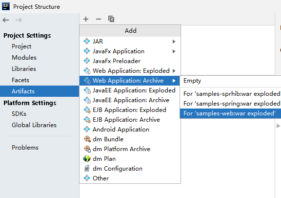
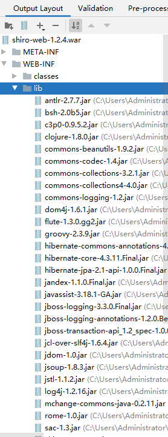
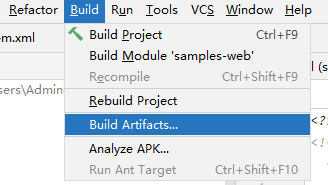
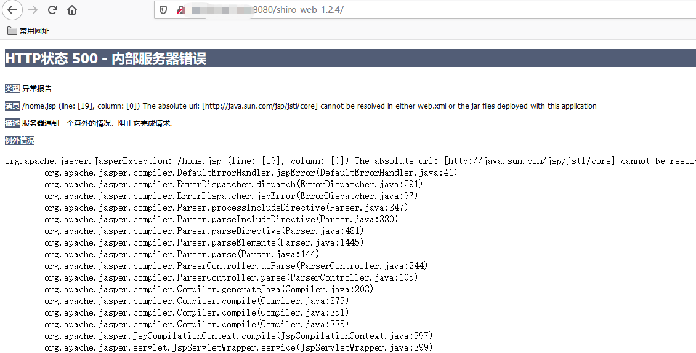

## 步骤
https://github.com/apache/shiro
下载特定版本的shiro，比如1.2.4，
在samples/web目录下，修改[pom.xml](https://github.com/apache/shiro/blob/master/samples/web/pom.xml)来引入需要的gadget，参考[ysoserial的pom.xml](https://github.com/frohoff/ysoserial/blob/master/pom.xml)
修改之后的项目：https://github.com/shadowsock5/shiro-root
在IDEA中导出war，放到tomcat的webapps目录下，重启tomcat，自动解压缩war包。
详见：









```
[cqq@localhost WEB-INF]$ pwd
/home/cqq/repos/apache-tomcat-8.5.59/webapps/shiro-web-1.2.4/WEB-INF
[cqq@localhost WEB-INF]$ ll
total 16K
drwxr-x---. 4 cqq cqq   60 Apr 16 03:08 ./
drwxr-x---. 5 cqq cqq 4.0K Apr 16 03:08 ../
drwxr-x---. 2 cqq cqq   29 Apr 18 19:11 classes/
drwxr-x---. 2 cqq cqq 4.0K Apr 16 03:08 lib/
-rw-r-----. 1 cqq cqq 1.8K Jul  8  2015 shiro.ini
-rw-r-----. 1 cqq cqq 1.6K Jul  8  2015 web.xml
[cqq@localhost WEB-INF]$ cd ../..
[cqq@localhost webapps]$ ll
total 33M
drwxr-xr-x. 10 cqq cqq 4.0K Apr 16 03:08 ./
drwxr-xr-x.  9 cqq cqq 4.0K Oct  6  2020 ../
drwxr-xr-x.  3 cqq cqq 4.0K Apr 14 00:22 axis/
drwxr-xr-x. 15 cqq cqq 4.0K Oct  6  2020 docs/
drwxr-xr-x.  6 cqq cqq   78 Oct  6  2020 examples/
drwxr-xr-x.  5 cqq cqq   82 Oct  6  2020 host-manager/
drwxr-xr-x.  6 cqq cqq 4.0K Oct  6  2020 manager/
drwxr-xr-x.  3 cqq cqq 4.0K Oct  6  2020 ROOT/
drwxr-x---.  5 cqq cqq 4.0K Mar 23 19:00 samples-web-1.2.4/
-rw-r--r--.  1 cqq cqq  11M Mar 23 03:53 samples-web-1.2.4.war
drwxr-x---.  5 cqq cqq 4.0K Apr 16 03:08 shiro-web-1.2.4/
-rw-r--r--.  1 cqq cqq  22M Apr 16 03:06 shiro-web-1.2.4.war
[cqq@localhost webapps]$ ll shiro-web-1.2.4/WEB-INF/lib/
total 24M
drwxr-x---. 2 cqq cqq 4.0K Apr 16 03:08 ./
drwxr-x---. 4 cqq cqq   60 Apr 16 03:08 ../
-rw-r-----. 1 cqq cqq 435K Mar  4  2020 antlr-2.7.7.jar
-rw-r-----. 1 cqq cqq 375K Apr 24  2020 bsh-2.0b5.jar
-rw-r-----. 1 cqq cqq 487K Mar 13  2020 c3p0-0.9.5.2.jar
-rw-r-----. 1 cqq cqq 3.5M Apr 24  2020 clojure-1.8.0.jar
-rw-r-----. 1 cqq cqq 229K Mar 16  2020 commons-beanutils-1.9.2.jar
-rw-r-----. 1 cqq cqq  57K Jul  8  2020 commons-codec-1.4.jar
-rw-r-----. 1 cqq cqq 562K Mar 10  2020 commons-collections-3.2.1.jar
-rw-r-----. 1 cqq cqq 596K Mar 13  2020 commons-collections4-4.0.jar
-rw-r-----. 1 cqq cqq  61K Mar 12  2020 commons-logging-1.2.jar
-rw-r-----. 1 cqq cqq 307K Mar  4  2020 dom4j-1.6.1.jar
-rw-r-----. 1 cqq cqq  78K Apr 24  2020 flute-1.3.0.gg2.jar
-rw-r-----. 1 cqq cqq 4.4M Apr 24  2020 groovy-2.3.9.jar
-rw-r-----. 1 cqq cqq  74K Apr 24  2020 hibernate-commons-annotations-4.0.5.Final.jar
-rw-r-----. 1 cqq cqq 5.1M Apr 24  2020 hibernate-core-4.3.11.Final.jar
-rw-r-----. 1 cqq cqq 111K Mar 24  2020 hibernate-jpa-2.1-api-1.0.0.Final.jar
-rw-r-----. 1 cqq cqq  75K Apr 24  2020 jandex-1.1.0.Final.jar
-rw-r-----. 1 cqq cqq 698K Apr 24  2020 javassist-3.18.1-GA.jar
-rw-r-----. 1 cqq cqq  66K Mar  4  2020 jboss-logging-3.3.0.Final.jar
-rw-r-----. 1 cqq cqq  12K Apr 24  2020 jboss-logging-annotations-1.2.0.Beta1.jar
-rw-r-----. 1 cqq cqq  28K Apr 24  2020 jboss-transaction-api_1.2_spec-1.0.0.Final.jar
-rw-r-----. 1 cqq cqq  17K Jul 27  2020 jcl-over-slf4j-1.6.4.jar
-rw-r-----. 1 cqq cqq 150K Mar 10  2020 jdom-1.0.jar
-rw-r-----. 1 cqq cqq 308K Apr 24  2020 jsoup-1.8.3.jar
-rw-r-----. 1 cqq cqq  21K Jul 27  2020 jstl-1.1.2.jar
-rw-r-----. 1 cqq cqq 471K Apr 27  2020 log4j-1.2.16.jar
-rw-r-----. 1 cqq cqq 593K Mar  4  2020 mchange-commons-java-0.2.11.jar
-rw-r-----. 1 cqq cqq 215K Apr 24  2020 rome-1.0.jar
-rw-r-----. 1 cqq cqq  16K Mar 10  2020 sac-1.3.jar
-rw-r-----. 1 cqq cqq 360K Apr 16 18:06 shiro-core-1.2.4.jar
-rw-r-----. 1 cqq cqq 135K Apr 16 18:06 shiro-web-1.2.4.jar
-rw-r-----. 1 cqq cqq  26K Mar 26  2020 slf4j-api-1.6.4.jar
-rw-r-----. 1 cqq cqq 9.6K Jul 27  2020 slf4j-log4j12-1.6.4.jar
-rw-r-----. 1 cqq cqq 451K Oct 15  2020 spring-beans-2.5.jar
-rw-r-----. 1 cqq cqq 265K Oct 15  2020 spring-core-2.5.jar
-rw-r-----. 1 cqq cqq 217K Oct 15  2020 spring-web-2.5.jar
-rw-r-----. 1 cqq cqq 521K Apr 24  2020 vaadin-sass-compiler-0.9.13.jar
-rw-r-----. 1 cqq cqq 2.8M Apr 24  2020 vaadin-server-7.7.14.jar
-rw-r-----. 1 cqq cqq 405K Apr 24  2020 vaadin-shared-7.7.14.jar
-rw-r-----. 1 cqq cqq 107K Mar 10  2020 xml-apis-1.0.b2.jar
```
