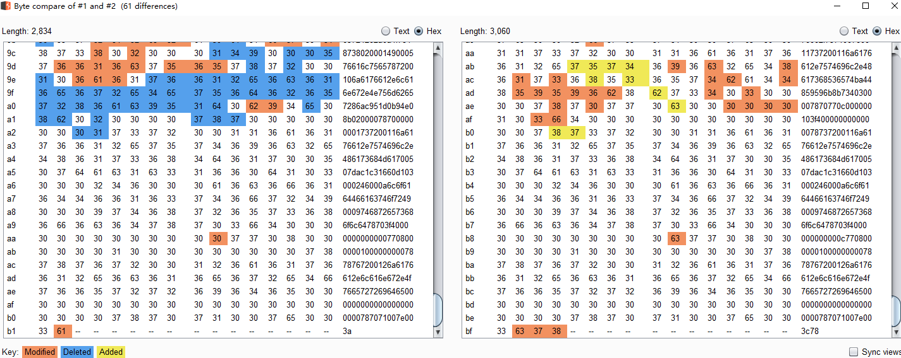
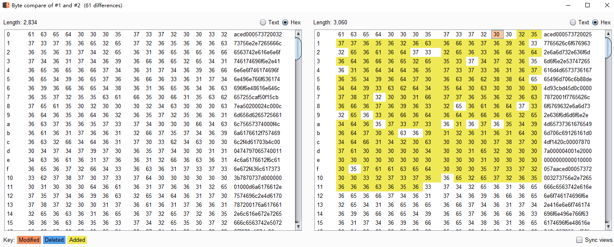

## weblogic的反序列化
起源：https://foxglovesecurity.com/2015/11/06/what-do-weblogic-websphere-jboss-jenkins-opennms-and-your-application-have-in-common-this-vulnerability/
这篇经典文章，他们找漏洞的方法是，使用自带的stopWeblogic.sh脚本对weblogic实例进行关闭时，在对weblogic的7001的t3协议进行抓包时发现流量中有java反序列化之后的数据aced0005，
iiop/t3的gadget梳理：
```
有JRMP的，还有RCE的，还有JNDI注入的。JRMP的先不说了，说直接可以RCE的。
```
两个关键，
> 一个是触发反序列化的点，二是gadget。

有些CVE是对weblogic的反序列化触发点的绕过，虽然都是readObject，但是每个类可能有不同的ObjectInputStream，而且防御机制的介入点不一样，导致了可以在不同触发点进行绕过。
参考：http://redteam.today/2020/03/25/weblogic%E5%8E%86%E5%8F%B2T3%E5%8F%8D%E5%BA%8F%E5%88%97%E5%8C%96%E6%BC%8F%E6%B4%9E%E5%8F%8A%E8%A1%A5%E4%B8%81%E6%A2%B3%E7%90%86/

反序列化开端：

### 【CVE-2015-4852】：由于没有任何防御机制，直接使用CommonsCollections1即可利用

=》补丁：在三个地方设置检查：
```
weblogic.rjvm.InboundMsgAbbrev.class::ServerChannelInputStream
weblogic.rjvm.MsgAbbrevInputStream.class
weblogic.iiop.Utils.class
```
后面的绕过其实都是不让payload过这些地方的检查。
在weblogic.rjvm.InboundMsgAbbrev.ServerChannelInputStream#resolveClass方法中增加if判断，对拿到的class的名字进行isBlackListed方法判断，若在黑名单则抛出Unauthorized deserialization attempt异常。

### 【CVE-2016-0638】：绕过ServerChannelInputStream中的黑名单机制，先利用黑名单之外的weblogic.jms.common.StreamMessageImpl#readExternal，在该方法内部使用自己的ObjectInputStream的readObject方法，这样就绕过了CVE-2015-4852的补丁的黑名单机制。
gadget依然选择使用CommonsCollections1；
利用方式：重写StreamMessageImpl类的writeExternal方法，将CommonsCollections1通过输出流写入；
参考：https://y4er.com/post/weblogic-cve-2016-0638/

=》补丁：

说明：CVE-2016-0638的payload就是在CVE-2015-4852payload的基础上，套了一层weblogic.jms.common.StreamMessageImpl对象的外衣，所以从payload来看有很大相似度；




### 【CVE-2016-3510】

与CVE-2016-0638类似，也是把CVE-2015-4852的payload套进去了，从而绕过黑名单的限制。与CVE-2016-0638找到的weblogic.rjvm.InboundMsgAbbrev.ServerChannelInputStream不同，
CVE-2016-3510是利用weblogic.corba.utils.MarshalledObject这个类，这个类有一些特性，比如其构造方法接收一个Object类型的参数，并且会通过writeObject将这个Object对象序列化之后赋值给this.objBytes；
而其readResolve方法中，会new一个ObjectInputStream然后将this.objBytes反序列化。


参考：[从Weblogic原理上探究CVE-2015-4852、CVE-2016-0638、CVE-2016-3510究竟怎么一回事](https://xz.aliyun.com/t/8443#toc-5)


### 【CVE-2019-2890】
与CVE-2016-0638类似，这个CVE是通过找到黑名单之外的weblogic.wsee.jaxws.persistence.PersistentContext#readObject这个特殊类的特殊readObject方法，也是自己new了一个ObjectInputStream，然后调用其readObject方法，
思路都是先绕过官方某些卡点的检查，然后在另一个不设防的地方干CVE-2015-4852中使用的CommonsCollections1的事儿——新瓶装旧酒。

参考：https://paper.seebug.org/1069/


### 【CVE-2020-2555】

```
javax.management.BadAttributeValueExpException#readObject()->
    coherence.jar!com.tangosol.util.filter.LimitFilter#toString()->
        coherence.jar!com.tangosol.util.extractor.ChainedExtractor#extract()->
            coherence.jar!com.tangosol.util.extractor.ReflectionExtractor#extract()->
                Method#invoke()->
                ...
            coherence.jar!com.tangosol.util.extractor.ReflectionExtractor#extract()->
                Method#invoke()->
                    Runtime#exec()
```

### 【CVE-2020-2883】对CVE-2020-2555补丁的绕过

由于补丁限制了LimitFilter方法中调用ChainedExtractor#extract()方法，
但是仍然可以用
- com.tangosol.util.comparator.ExtractorComparator.compare()来调用ChainedExtractor#extract()
- com.tangosol.util.extractor.AbstractExtractor.compare()-> com.tangosol.util.extractor.MultiExtractor.extract()来调用ChainedExtractor#extract()

所以有两条链都可以绕过。

### 参考
- [CVE-2020-2883:Weblogic反序列化](https://xz.aliyun.com/t/8577)


## 参考
- [weblogic历史T3反序列化漏洞及补丁梳理](http://redteam.today/2020/03/25/weblogic%E5%8E%86%E5%8F%B2T3%E5%8F%8D%E5%BA%8F%E5%88%97%E5%8C%96%E6%BC%8F%E6%B4%9E%E5%8F%8A%E8%A1%A5%E4%B8%81%E6%A2%B3%E7%90%86/)
